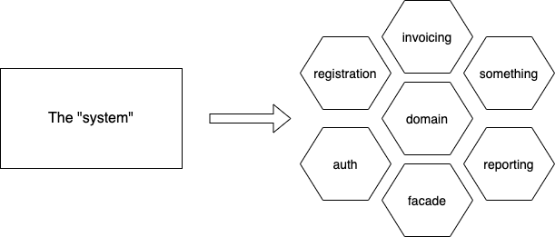

# Copy-Paste Driven Development

by @apokralipsa

Nowadays, modern applications are often split to multiple microservices. Their complexity is usually overwhelming for 
not only developers but also for analysts and domain experts. To tackle down this complexity it is common to introduce 
even more microservices, making them a perfect sample for Copy-Pasta Driven Development. Even if your work does not look 
like dashing through the rainbow with microservices, but rather like unclogging sewers with your bare hands, you will be 
surprised in how many situations you can benefit from Copy-Pasta Driven Development.

Take a closer look at our sample. Starting from a simple system, that is a monolith, and crush it to some microservices.

We do not want to look into all services, we are going to focus on just two microservices - `reporting`, which is 
providing excel reports for important people to do important stuff, and `facade`, that exposes data to external services
by some interface. Most of the data are the same, and more importantly, they are consuming data from the same source of truth.

Some day, there is new data that is going to be exposed through `facade` and, of course, your business wants it also 
in the report - but those are two different microservices now!

## When to use it

Every time, you will face a situation, that you need to implement similar functionality in separated context, you might 
use Copy-Paste Driven Development. Some of the people will say to you, that you should make a library from common parts and
include it in your microservices, but there are numerous reasons against it:
* microservices should be independent. They might be even using different technologies. You do not want to make a common dependency, coupling your services
* someone will have to maintain this library. With multiple teams, it will be hard to set up responsibility
* when another team is responsible for the library, you might wait some time for a new version of the library to use

Any time you are going to implement similar, or even the same functionality in another place, use Copy-Paste Driven Development.

## How to introduce

There are two ways to introduce it: the hard way and easy way.

#### Easy way

Start from splitting your application well. Reorganize packages, make them as much independent as possible. Make test fixtures,
separate those portions of code into microservices. Now, keep them separate, use Copy-Paste Driven Development in case if
you need to implement a new, similar feature. If you are going to Copy and Paste small portions of code, then it will be easy.
Keeping it really separate will also simplify Copy and Pasting

#### Hard way

Basically, do everything like in "Easy way", but exactly opposite. Only keep last part about Copy and Pasting.

## Benefits

Using Copy-Paste Driven Development will reduce complexity and dependency between modules. Additionally, when you have
to implement a feature in three different modules, you will save time, as you only need to implement it once, and then
Copy-Paste to another. Although, sometimes you will hate yourself for doing it and it will make you want to leave  
everything behind you, go to mountains and live a simple life as a shepherd.
