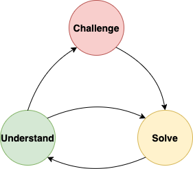

# Kinesthetic Programming

by @bandrzejewski

Numbers of developers that are reading documentation in order to understand used code are doomed to failure. The reason behind 
this is that they need to understand both code and the documentation. Let's be honest, there are only a few developers that
can write good code and good, explanatory documentation. It is even common, that different persons are writing those parts.
It is very easy to introduce misleading information causing confusion and misunderstanding. In order to solve this problem,
Kinesthetic Programming could be used. It reduces the amount of point of failures by simply skipping documentation at all.
Instead of that, it develops skills that seem to be vanishing among developers, like reading others code, understanding
it, or ability to debug the code.

Kinesthetic Programming is based on a few fundamentals:
* code, that you are using for implementing a feature should have meaningful naming. Methods, that you are using, should be descriptive but compact
* quick feedback loop - it is the best if you have a set of unit tests that can give you a response in milliseconds, but any test suite that executes faster than you unlock your smartphone will go
* access to source codes of classes and libraries that you are using
* IDE with nice code assistant

You maybe wonder, what are the 'secret' techniques of kinesthetic programming. 
Let's take a look at a few examples and describe some behaviours. 

Did you ever notice, when running your tests, some weird exception in the logs? 
Or did you ever tried to introduce some new fancy technology, with a cool name - 
but somehow it did not jump started right away? I know you did. Every one of us knows this 
feeling. That's are the situations where Kinesthetic comes into play. One of the techniques is 
CAR - Change and Run. It is all about 'feeling' the code. You just try to change some pieces of 
code/ configuration - that you think will fix it - and give it a try. If not succeeded, introduce 
another change and repeat the process until success. By following CAR technique, we need to focus on 
the practice and we try to skip documentation reading part (which is often incomplete/ or just really boring). 

Another sole part of the techniques is the way how we look at the answers on the internet. Everyone from time 
to time (Ok, mostly) looks for a solution by simply googling it. That's perfectly fine, but how you use the 
articles/documentation is not so obvious. You might want to read them whole - usually few pages of reading - 
but let's be honest, who writes that, it's usually rubbish. The whole clue of the reading is usually somewhere in 
the bottom - yes - The Snippets! What kinesthetic encourages you to do is to go straight away to the merits, just 
copy The Snippets and give it a try. That will probably save you a lot of time. It usually works, but sometimes the 
snippets do not fit right into our projects - you might ask what then? It is perfectly fine to open another article 
and give it a try - follow the kinesthetic approach! If you feel confident, you can even try to combine snippets from 
different articles - but that will require some experience. You are adept, better not to overengineer it and stick to one.

Hope you are familiar with Java language, as an example for Kinesthetic Programming will be provided in this language.
Actually, you should be able to understand the sample as long as you know any Object-Oriented language and Fluent Interface.
Our application will be responsible for making a calculation. Its main task will be subtracting two numbers, so it solves 
an equation like `a - b`. Let's look at the first code:

```
    Double solve(Double a, Double b) {
        return a - b;
    }
```

As this code using floating-point based classes, we need to use `BigDecimal` class to avoid mantissa rounding problems.
`BigDecimal` class provides `min(BigDecimal)` method, that might be understood as "minus" operation. Let's use it!

```
    BigDecimal solve(BigDecimal a, BigDecimal b) {
        return a.min(b);
    }
```

Unfortunatelly, after testing it, it appears that our methods for invocation of `solve(10, 7)` returns value `7`. To understand
why this happen, we need to go into implementation of `min` method:

```
    public BigDecimal min(BigDecimal val) {
        return (compareTo(val) <= 0 ? this : val);
    }
```

Surprise! It does not perform "minus" operation, but returns _minimal_ value of provided numbers! Now we need to find another
method in `BigDecimal` class that will allow us to solve our problem.


## When to use it

It is highly advised to use Kinesthetic Programming always when you have some spare time. Sometimes it is mandatory, eg.
when documentation is misleading, does not exist at all, or code that you are using is new and nobody knows it yet.

## How to introduce

Before you introduce Kinesthetic Programming you need to understand The Challenge-Solve-Understand loop:



1. Start with a Challenge - a feature, the smallest thing that has to be implemented.
    * it is a definition of what needs to be done
    * Kinesthetic Programming goes very well with Unit Testing - use them to define the result
    * Do not implement solution till Challenge is defined!
2. Solve - write a portion of code that _might_ solve the Challenge. It does not have to do it properly, just start with anything that comes to your mind
3. Understand why your solution:
    * failed: this is crucial in understanding how library or classes that you are using are working. Understood why it failed? Then go back to Solve step. Still not sure why it failed? Dig deeper, debug or ask someone for help.
    * succeeded: check, how it is working - you might benefit from understanding how others are thinking
4. Once solution succeeds, and you understand why, you are ready for another Challenge!

## Benefits

Lets sum up, what you will gain by using Kinesthetic Programming:
* code with high code coverage
* deeper understanding of used technologies
* ability to understand others code
* confidence while debugging code

_P.S. proper method to use with `BigDecimal` is `subtract`_
