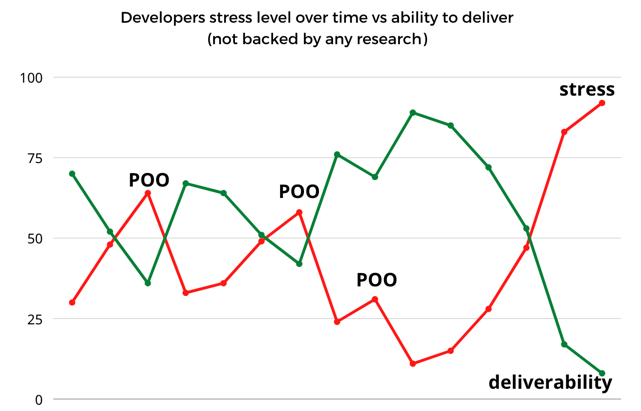
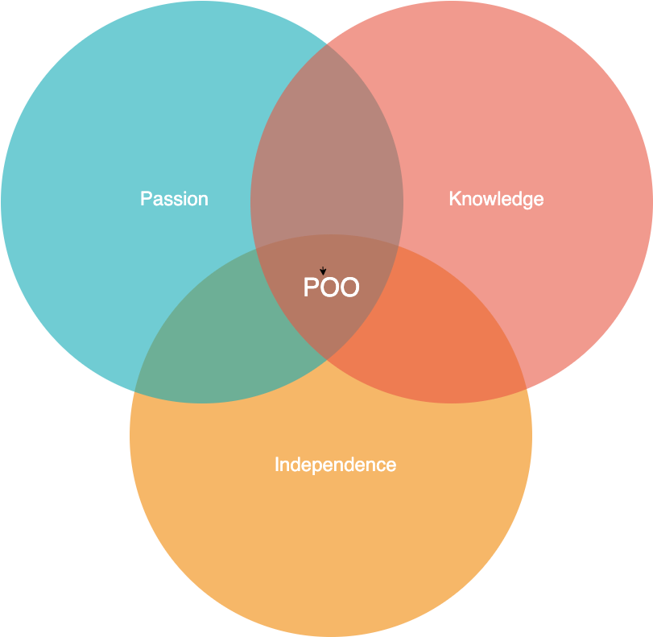
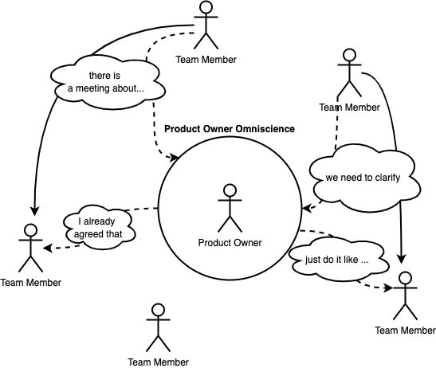

# Product Owner Omniscience

by [@pawelpluta](https://github.com/pawelpluta)

Delays in projects are usually unavoidable. Every delay is a money loss that will be painful for your company. 
Depending on the project, it might be counted in thousands, or billions of dollars. Take a look at Berlin Brandenburg Airport.
Due to delays its final cost was 8.2 billions dollars, exceeded the budged over twice. This value is not taking into account the loss from revenues over the years the airport was closed!

### Delays in IT projects

Very similar situation, maybe at little different scale, might happen in your company. 
The core problem of delays in IT projects are developers, or rather the problems, that developers have.
They are stressed out. Technology-related decisions made every minute does not leave them unaffected.
On top of that, new approaches that require their contact with other human beings or talk to business people are getting more and more common.
All these situations lead to conflicts inside a team, and a well-known thing is that conflicts are disturbing the delivery process.
This is the place, where the unique but balanced set of skills can distinguish a good Product Owner.
Rapid and dynamic changes adopted by world leaders requires some technique that allows for taking tight turns.
Make a pivot into Product Owner Omniscience (I will refer to it as POO for reading simplicity) and be prepared for unprecedented challenges you and your team will face.
Deep dive into a POO and identify every synergy that you and your team will benefit from.

A POO is a thing directly between the Product Owner and the team of developers.
Your role, as a Product Owner, is to bring fresh air.
Fortunately, POO is low-hanging fruit.

## How does it work

While doing a POO, you must bring relief to the team members by giving them answers to the questions they didn't even ask yet.
That's right! You need to think like a developer, act as a developer, smell like a developer, even if you have zero experience in it.
Taking this heavy baggage from them will make team members happier, and allow you to deliver anything on any deadline (after some adjustments!).



As you can see, there is a clear, inversely relation between stress level and ability to deliver things.
With every POO action, there is a stress relief that causes the team to bind by the common goal, focusing on the same thing.
Be aware that after some time you will need to take another POO action to dump some constantly increasing pressure.

## When to use it

POO is not a golden mean applicable for every team. If it would be so, then everyone would do that.
To understand when make a POO, you first need to know how to identify signs it will not come out.
When the team that you are working with is doing some easy stuff, like CRUD service, or data conversion service it usually means that it will not benefit from it.
Additionally, when the team is composed of fresh devs, who have little experience, then there will be no gain from POO for sure.

Teams that will benefit from POO are mostly the ones who are passionate about their work, know a lot of approaches and technologies.
People who love to crush complex problems will benefit from it, as you will take some of their problems away, giving them space for other ones.



When all three things occur in your team, then this is a place where POO will have the biggest impact.

## How to introduce

This is the best part. You do not ask the team about making a POO.
Asking them is literally giving them another thing to be worried about, and POO is all about taking it away.
You, as a Product Owner, must have the answer for every question - immediately.
No matter, if it is related to business, technical or human-related - just give the answer.

The tricky part is that the team will probably not ask you about anything.
You need to catch the doubts they have and step in with your POO! Look for phrases like:
* we had a discussion about something
* we need to clarify it
* someone asked us how we can do something
* there was a talk by the coffee machine
* there is a meeting regarding some topic



As shown on the diagram, you need to catch certain phrases, and instead of direct communication between team members,
you throw your POO skill in between and answer the questions for them.
Sample of POOed communication can be anything, but this example should put more light on it:
```
  Dev1: We had a discussion over how to intend the lines of codes. We proposed 4 spaces.
  Dev2: Yeah, but that was not the approach some of us liked. I prefer using 2 spaces. In final, we came to the conclusion, that we should use ta...
  PO: ...Then use 3 spaces everywhere.
  Dev1 & Dev2: ?!
  PO: Use 3 spaces everywhere.
```

## How to gather knowledge

Answering questions is easy, but you need to gather knowledge. It is great if you can get it without team awareness.
To do that, you need to take an initiative.
* look for other product owners, team leaders and architects. Talk with them a lot
* especially valuable are team leaders of teams, who are working with waterfall-like approach
* create documents with information that you gathered, together with conclusions
* throw a lot of meetings with business people. This will make you visible and will build trust in you
* include in CC in mails someone from higher management, at least one level above you

## Benefits

Making a POO will result in two types of benefits. First are the team benefits, which usually are:
* team is focused on a common goal
* they do not need to worry about making hard decisions
* team does not need to worry about deadlines
* making a POO binds team members, as they have more time to spend time with each other

The second type of benefits are your personal ones:
* you are the central point of contact, so team members are not disturbed
* your name is recognized in the organization
* you will hear your name a lot. That is very uplifting
* it will be easier for you to get a rise

As you can see, making a POO is hard at the beginning, but it can give you a lot of positive things!
