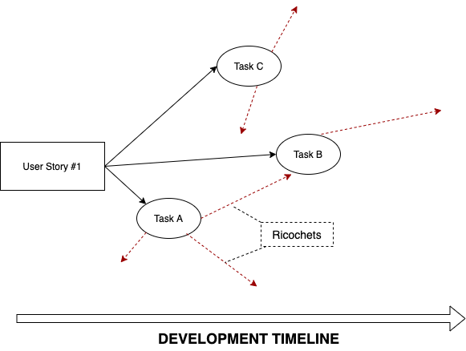
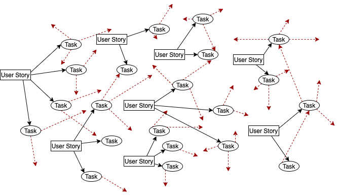

# Ricochet Programming

by @pawelpluta

The subtle, but very powerful technique, allowing you to boost up the development process and save your time for another round of Tekken 3.
Ricochets are specialized tools for resolving small tasks and even user stories at almost zero cost. The smaller tasks are,
the bigger benefit can be achieved. Ricochets are not very accurate, therefore they cannot be always 
used, but when there are multiple targets, the probability of hitting increases.

Let's understand the process of triggering ricochets:

Assuming, that you are refining work pretty well, and create tasks for each user story. According to the timeline, developer 
started the work from `Task A`. Once finished, `Task C` was started, and then `Task B`. During work on each of the tasks, 
small portions of code were added, that developer is unaware they might reflect other parts of code. Those ricochets, when
code is developed with high quality, might hit other tasks, crushing them and reduces their complexity.

Now, using scale-up and multiplying the amount of user stories, tasks, and developers, we can see how ricochets are multiplying,
helping to crush more and more tasks!

## Audience

Most benefits from this methodology will be taken by developers

## When to use it

Unfortunately, ricochets itself and Ricochet Programming is not something, that you can intentionally use. 
They just happen, however, you can take steps and help them to occur. As this technique is relatively cheap, you should 
aim to take those steps and try to trigger ricochets.

## How to introduce

The best in this methodology is that you can introduce it by yourself, not even telling anyone about it. However, consider
convincing other team members, so you will have a higher amount of ricochets and benefit more.

* refine your stories properly. Crush them to the smallest tasks possible
* plan every task. Maybe it will need some refactor before implementation?
* every time you see a part of code, that could be improved a little bit, consider doing it (in separate pull request)
* keep pull/merge requests small
* write tests, ensure that code is good quality. In other case, ricochets will not crunch tasks to smaller but will hit your already existing application and slowly kill it

## Benefits

Trying to achieve a high amount of ricochets, will save you time in the future. It will start by reducing the complexity of 
tasks, but it might event accidentally solve whole tasks, saving you time for serious activities, like watching cats.
